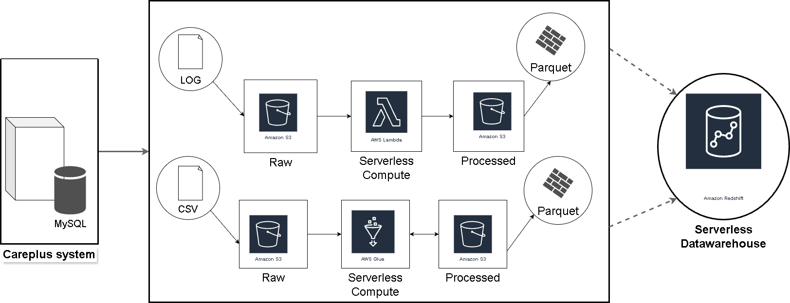

# AWS Support Data ETL Pipeline

## 📌 Project Overview

This project implements an automated, serverless ETL pipeline on AWS to ingest, process, and load structured and unstructured support data.

The pipeline handles:
- Unstructured support log files (.txt)
- Structured support ticket data (CSV export)

It demonstrates core data engineering concepts including ingestion, transformation, incremental loading, partitioning, and data quality validation.

---

## 🏗️ Architecture

### High-Level Flow

Source Files (Logs / Tickets)  
        ↓  
Amazon S3 (Raw Zone)  
        ↓  
AWS Lambda (Log Parsing)  
AWS Glue (Ticket ETL)  
        ↓  
Amazon S3 (Curated - Parquet, Partitioned)  
        ↓  
AWS Lambda (Incremental Load)  
        ↓  
Amazon Redshift  

---

## 🗂️ Data Lake Structure

S3 bucket structure:

